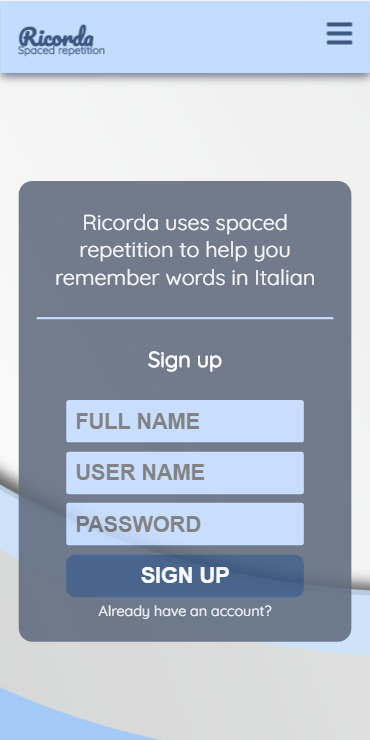
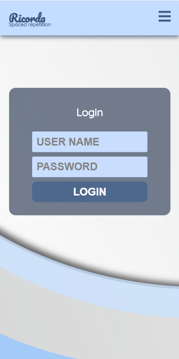
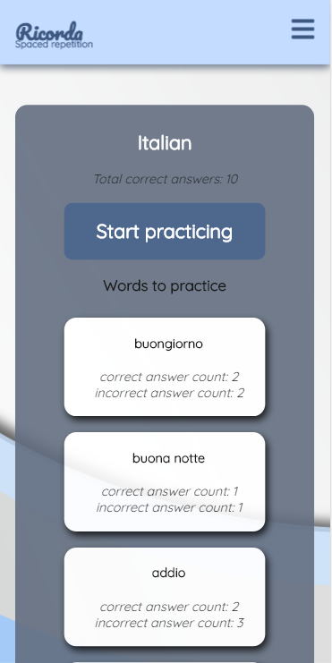
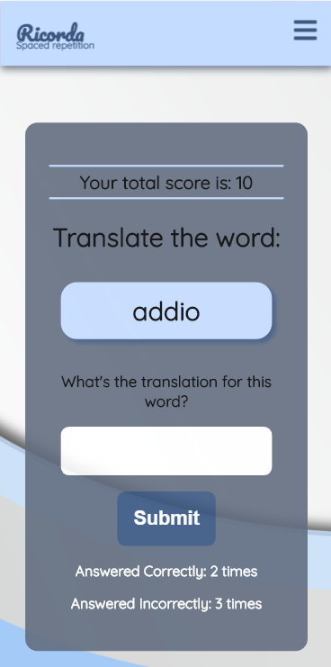

# Ricorda - Spaced Repetition

* Live version: https://ricorda.now.sh
* Required Ricorda API:
  - Live: https://fathomless-scrubland-69489.herokuapp.com
  - Rpository: https://github.com/thinkful-ei-gecko/Yulia-JamesL-Spaced-Repetition-Server
 
## Description
Ricorda implements spaced repetition in JavaScript. It has an initial mode for learning new words in Italian. Each word has corresponding 'memory value' starting at 1. If the user's answer was correct double the value. If the answer was wrong reset value to 1. Then move question back value number of places in the list. The algorithm implemented using a singly linked list.

## To setup the application

* Clone the project to your machine and run `npm install`. This will also install the application *Cypress.io* for running browser integration tests
* To run `npm start`

## Running the tests

This project uses [Cypress IO](https://docs.cypress.io) for integration testing using the Chrome browser.
Cypress has the following expectations:
- You have cypress installed (this is a devDependency of the project)
- You have your application running at http://localhost:3000.
  - You can change the address of this expectation in the `./cypress.json` file.
- Your `./src/config.js` is using http://localhost:8000/api as the `API_ENDPOINT`

To start the tests run the command:

```bash
npm run cypress:open
```

On the first run of this command, the cypress application will verify its install. Any other runs after this, the verification will be skipped.
The command will open up the Cypress application which reads tests from the `./cypress/integration/` directory. You can then run individual tests by clicking on the file names or run all tests by clicking the "run all tests" button in the cypress GUI.

Tests will assert against your running localhost client application.

You can also start all of the tests in the command line only (not using the GUI) by running the command:

```bash
npm run cypress:run
```

This will save video recordings of the test runs in the directory `./cypress/videos/`.

## Screenshots

### Sign up page


### Login page


### Dashboard 


### Learning page


## Tech stack
- ReactJs
- CSS3